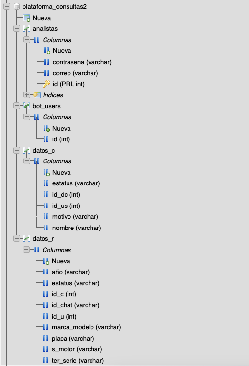

# IngSoft_VehicleReport

Proyecto de Ingeniería de software II: Reporte de vehiculos por medio de un bOT de Telegram.

## Requisitos 
- Xampp
- Estructura de base de datos mySQl

## How to add to local project
1. [Install Xampp](https://www.apachefriends.org/es/download.html)
2. Run Xampp, and go to Application Folder.
3. In the application folder clone the repositiry

```
$ git clone https://github.com/EmanuelRdzM/IngSoft_VehicleReport.git
```

## Base de datos:


<h3>Privilegios de la base de datos:</h3>

|  DB_name |  user_name | server_name | password |
|----------|------------|-------------|----------|
| plataforma_consultas2 | root | localhost | " " |

*no password
